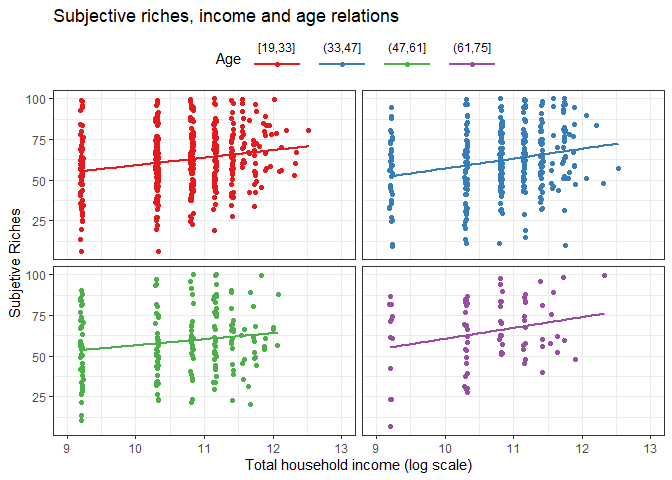

Subjetive Well-Being Data Task
================

# Code and Resources Used

**R version** 4.1.1

**Packages:**

-   `tidyverse`
-   `here`
-   `fs`
-   `modelsummary`
-   `librarian`

**Reference**

-   [Subjective Well‐Being and Income: Is There Any Evidence of
    Satiation?](https://www.brookings.edu/wp-content/uploads/2016/06/subjective-well-being-income.pdf)
-   [Topincomesandsubjectivewell-being](https://www.sciencedirect.com/science/article/abs/pii/S0167487018302952?via%3Dihub)

## Data

| Column name | Description                                                                                                  |
|-------------|--------------------------------------------------------------------------------------------------------------|
| `aspect`    | Name of aspect of well-being                                                                                 |
| `worker`    | Unique string of letters and number identifying respondent                                                   |
| `time`      | Time that the respondent recorder his/her rating. Reported in Unix time (Number of seconds sice Jan. 1 1970) |
| `rating`    | Rating on a scale from 0 to 100                                                                              |
| `age`       | Age of respondent                                                                                            |
| `male`      | Bynari variable fro respondent gender. 0 indicates female and 1 indicates male                               |
| `income`    | Respondent’s total household income                                                                          |
| `education` | Respondent’s completed level of education                                                                    |
| `race`      | Race of respondent                                                                                           |

## Requirements

``` r
if(!require("librarian")) install.packages('librarian')
```

## Load libraries

``` r
librarian::shelf(tidyverse, here, fs, modelsummary)
```

## Directories

``` r
data <- here::here('data', 'Data Task')

fs::dir_tree(here(data))
```

    ## C:/Users/Jhon/Documents/Me/intern-data/data/Data Task
    ## +-- demographics.csv
    ## +-- Intern_Data_Task.pdf
    ## \-- ratings.csv

``` r
fs::dir_delete("plots")


if(!dir.exists('plots')){dir.create("plots")}

fs::dir_tree("plots")
```

    ## plots

# Question 1

## a) Load `ratings.csv`

``` r
ratings <- read_csv(here::here(data, "ratings.csv"))
head(ratings)
```

    ## # A tibble: 6 x 4
    ##   aspect                                           worker            time rating
    ##   <chr>                                            <chr>            <dbl>  <dbl>
    ## 1 how happy you feel                               AW31492615~    1.50e12     69
    ## 2 how much you like your home house or apartment   AW31492615~    1.50e12     67
    ## 3 how satisfied you are with your life             AW31492615~    1.50e12     67
    ## 4 the extent to which you feel the things you do ~ AW31492615~    1.50e12     63
    ## 5 the quality of your sleep                        AW31492615~    1.50e12     59
    ## 6 you being a good moral person and living accord~ AW31492615~    1.50e12     72

## b) Report the number of unique respondents and the number of unique aspects in the data set

### Respondents

``` r
n_id <- 
  ratings %>% 
  distinct(worker) %>% 
  nrow()
n_id
```

    ## [1] 1056

### Aspects

``` r
n_a <- 
  ratings %>% 
  distinct(aspect) %>% 
  nrow()
n_a
```

    ## [1] 17

## c) Check to see if each respondent has only rated each aspect once. If this is not true, only include the most recent observation and report the number of observations you have dropped.

### No unique

``` r
ratings %>% 
  count(worker, aspect) %>% 
  filter(n > 1) %>% 
  nrow()
```

    ## [1] 237

### Most recent

``` r
ratings_unique <- 
  ratings %>% 
  with_groups(
    c(worker, aspect)
    , ~filter(., time == max(time))
  )
ratings_unique
```

    ## # A tibble: 17,952 x 4
    ##    aspect                                           worker           time rating
    ##    <chr>                                            <chr>           <dbl>  <dbl>
    ##  1 how happy you feel                               AW3149261~    1.50e12     69
    ##  2 how much you like your home house or apartment   AW3149261~    1.50e12     67
    ##  3 how satisfied you are with your life             AW3149261~    1.50e12     67
    ##  4 the extent to which you feel the things you do ~ AW3149261~    1.50e12     63
    ##  5 the quality of your sleep                        AW3149261~    1.50e12     59
    ##  6 you being a good moral person and living accord~ AW3149261~    1.50e12     72
    ##  7 you being able to spend enough time with the on~ AW3149261~    1.50e12     67
    ##  8 you being able to support your family financial~ AW3149261~    1.50e12     53
    ##  9 you feeling that your work has value             AW3149261~    1.50e12     60
    ## 10 you not feeling anxious                          AW3149261~    1.50e12     55
    ## # ... with 17,942 more rows

## d) Calculate the average rating for each respondent. We will call this measure subjective riches. Report the minimum, 25th percentile, 50th percentile, 75th percentile, and maximum subjective riches value.

``` r
rating_sub <- 
 ratings_unique %>% 
  with_groups(
    worker,
    ~summarise(
      .
      , sub_rich = mean(rating, na.rm = T)
    )
  )
rating_sub
```

    ## # A tibble: 1,056 x 2
    ##    worker          sub_rich
    ##    <chr>              <dbl>
    ##  1 AW1005987207        69.5
    ##  2 AW10083168508       25.9
    ##  3 AW10108518316       95.5
    ##  4 AW10192560152       61.5
    ##  5 AW1039734587YY      76.3
    ##  6 AW10414823617       57.6
    ##  7 AW10499348166OO     47.5
    ##  8 AW10537409847       47.5
    ##  9 AW10593137781       79.5
    ## 10 AW10684824993       64.5
    ## # ... with 1,046 more rows

``` r
quantile(rating_sub$sub_rich) %>% 
  enframe("Q", "")
```

    ## # A tibble: 5 x 2
    ##   Q         ``
    ##   <chr>  <dbl>
    ## 1 0%      5.76
    ## 2 25%    49.1 
    ## 3 50%    61.4 
    ## 4 75%    75.1 
    ## 5 100%  100

# Question 2

## a) Load `demographics.csv`

``` r
demographics <- read_csv(here(data, "demographics.csv"))
demographics
```

    ## # A tibble: 1,056 x 6
    ##    worker          age  male income education         race                
    ##    <chr>         <dbl> <dbl>  <dbl> <chr>             <chr>               
    ##  1 AW31492615119    23     0  30000 Some college      Asian (non-Hispanic)
    ##  2 AW45861491036    35     0  50000 Some college      Black (non-Hispanic)
    ##  3 AW62562980372    28     0  30000 Some college      Hispanic (any race) 
    ##  4 AW9806860651     55     1  70000 Bachelor's degree White (non-Hispanic)
    ##  5 AW8132561106     38     0  50000 Master's degree   White (non-Hispanic)
    ##  6 AW3914454237     51     0  10000 Bachelor's degree White (non-Hispanic)
    ##  7 AW35167700734    35     0  50000 Bachelor's degree White (non-Hispanic)
    ##  8 AW14391948969    65     0  30000 Some college      Black (non-Hispanic)
    ##  9 AW66605441796    37     0  30000 Some college      Asian (non-Hispanic)
    ## 10 AW11407426600    24     0  50000 Bachelor's degree White (non-Hispanic)
    ## # ... with 1,046 more rows

## b) Report the number of rows and check to see if it is the same as the number of unique respondents you calculated in question 1

### `ratings`

``` r
nrow(rating_sub)
```

    ## [1] 1056

### `demographics`

``` r
nrow(demographics)
```

    ## [1] 1056

### Check

``` r
nrow(rating_sub) == nrow(demographics)
```

    ## [1] TRUE

## c) Merge the subjective riches data from question 1 with the demographics data.

Well-Being (`w_b`)

``` r
w_b <- full_join(rating_sub, demographics)
w_b
```

    ## # A tibble: 1,056 x 7
    ##    worker          sub_rich   age  male income education         race           
    ##    <chr>              <dbl> <dbl> <dbl>  <dbl> <chr>             <chr>          
    ##  1 AW1005987207        69.5    36     1  30000 High school       Black (non-His~
    ##  2 AW10083168508       25.9    34     0  30000 High school       White (non-His~
    ##  3 AW10108518316       95.5    29     0  50000 Some college      White (non-His~
    ##  4 AW10192560152       61.5    43     1 125000 Bachelor's degree White (non-His~
    ##  5 AW1039734587YY      76.3    24     0  10000 Bachelor's degree White (non-His~
    ##  6 AW10414823617       57.6    24     0  50000 Some college      White (non-His~
    ##  7 AW10499348166OO     47.5    66     1 145000 Bachelor's degree White (non-His~
    ##  8 AW10537409847       47.5    54     0  70000 Some college      White (non-His~
    ##  9 AW10593137781       79.5    32     1 105000 Some college      White (non-His~
    ## 10 AW10684824993       64.5    24     1  50000 High school       Asian (non-His~
    ## # ... with 1,046 more rows

## d) Regress (with OLS) subjective riches on income and report the results.

``` r
modelsummary::modelsummary(list("Subjetive Rich" = lm(sub_rich ~ log(income), data = w_b)), output = "markdown", estimate = c("{estimate}{stars}"))
```

|             | Subjetive Rich |
|:------------|:--------------:|
| (Intercept) |     8.192      |
|             |    (7.857)     |
| log(income) |  4.994\*\*\*   |
|             |    (0.732)     |
| Num.Obs.    |      1056      |
| R2          |     0.042      |
| R2 Adj.     |     0.041      |
| AIC         |     9176.2     |
| BIC         |     9191.1     |
| Log.Lik.    |   -4585.116    |
| F           |     46.522     |

The results of the model indicate that the total income received has a
positive effect on their perception of happiness (subjective), that is,
families with high monetary income are happier than families with low
income. For this particular case, it is observed that in subjective
happiness it is on average 8.2, also if family income increases by 100
monetary units, your subjective assessment of happiness will increase by
5 units.

## e) Regress (with OLS) subjective riches on income with controls for age, age2 (age squared), gender, level of education, and race

``` r
modelsummary::modelsummary(list("Subjetive Rich" = lm(sub_rich ~ log(income) + age + I(age^2) + male + education + race, data = w_b)), output = "markdown",  estimate = c("{estimate}{stars}"))
```

|                                | Subjetive Rich |
|:-------------------------------|:--------------:|
| (Intercept)                    |    17.645+     |
|                                |    (10.570)    |
| log(income)                    |  4.775\*\*\*   |
|                                |    (0.777)     |
| age                            |     -0.373     |
|                                |    (0.295)     |
| I(age^2)                       |     0.004      |
|                                |    (0.003)     |
| male                           |    2.789\*     |
|                                |    (1.179)     |
| educationDoctoral degree       |     2.734      |
|                                |    (4.629)     |
| educationGraduate degree       |     -1.171     |
|                                |    (3.340)     |
| educationHigh school           |     -2.061     |
|                                |    (2.185)     |
| educationLess than high school |     4.772      |
|                                |    (8.402)     |
| educationMaster’s degree       |     -2.691     |
|                                |    (2.292)     |
| educationSome college          |    -2.766\*    |
|                                |    (1.340)     |
| raceBlack (non-Hispanic)       |     -1.558     |
|                                |    (3.064)     |
| raceHispanic (any race)        |     -1.640     |
|                                |    (3.288)     |
| raceMultiracial                |     7.470+     |
|                                |    (4.399)     |
| raceOther                      |     9.184      |
|                                |    (8.007)     |
| raceWhite (non-Hispanic)       |     0.421      |
|                                |    (2.384)     |
| Num.Obs.                       |      1055      |
| R2                             |     0.060      |
| R2 Adj.                        |     0.047      |
| AIC                            |     9175.3     |
| BIC                            |     9259.7     |
| Log.Lik.                       |   -4570.668    |
| F                              |     4.456      |

The model presented with the variables control, age, sex and education
and race, suggests that income, sex (male) and education (Some College)
are relevant variables in their perception of happiness, in this case it
also affirms that wealthy families have A higher subjective perception
of happiness with low income, in the same way, men have a better score
of their happiness in 2 points, finally, people who only studied a few
years at university and dropped out have a negative perception of their
happiness of 2 points. Given this, no evidence was noted that race had
significance in happiness.

## d) Imagine you were also given each respondent’s household size. How would you change your analysis above in light of this new information? (Max 100 words)

If we add the size of the household, the responsibilities would increase
in some cases, for families with few monetary resources, having more
children would be greater responsibilities, therefore their perception
of happiness would be lower than those without children since they could
allocate the money available for their own human development. While
high-income families would be indifferent.

# Question 3

## a) Figure: income, ratings of health and age

``` r
set.seed(12)
plot0 <- 
  w_b %>% 
  mutate(
    income = log(income)
    #, age_cut = cut_interval(age, 2)# cut_width(age, 2)
    , income_cut = cut_interval(income, 5)
    , age_cut = cut_interval(age, 4)
    ) %>% 
  ggplot() +
  aes(income, sub_rich, color = age_cut) +
  geom_jitter(height = .25) +
  facet_wrap(~age_cut, ncol = 2) +
  scale_x_continuous(breaks = seq(from = 6, to = 13, by = 1)) +
  xlim(9, 13) +
  labs(
    y = "Subjetive Riches"
    , x = "Total household income (log scale)"
    , title = "Subjective riches, income and age relations"
    ) +
  theme_bw() +
  geom_smooth(method = 'lm', se = F) +
  scale_colour_brewer(
    palette = "Set1"
    , name = "Age"
    , guide = guide_legend(
      direction = 'horizontal'
      , title.position = 'left'
      , title.hjust = .3
      , title.vjust = .3
      , label.hjust = .5
      , label.position = 'top'
      , keywidth = 3
      , keyheight = .5
    )
    ) +
  theme(
    legend.position = "top"
    , strip.background = element_blank()
    , strip.text = element_blank()
    , axis.text.x = element_text(vjust = .9)
  )
plot0
```

<!-- -->

## b) Produce and save the scatterplot (or if you prefer, up to two proposals for alternative scatterplots).

``` r
ggsave(plot = plot0, file = here::here("plots", "plot0.png"), dpi = 300)
```

## c) From a policy perspective, understanding the determinants of well-being is an important question. Describe the ways in which your regressions in the previous question and your scatterplot(s) help or do not help answer this question. Think about your proxy for well-being (subjective ratings) as well as the specification of your regressions. (Max 250 words)

Policy actions, in order to improve people’s well-being, focus on
variables which may directly affect, in this particular case, income,
which may be donations or other types of transfers, or which may be
influenced through policy action. In this case it would be education,
however the coefficients associated with the different levels of
education (except doctorate degree) were negative, that is to say that
the more they study the level of happiness will decline if these
variables were relevant, while the other variables are currently
difficult to manipulate.
