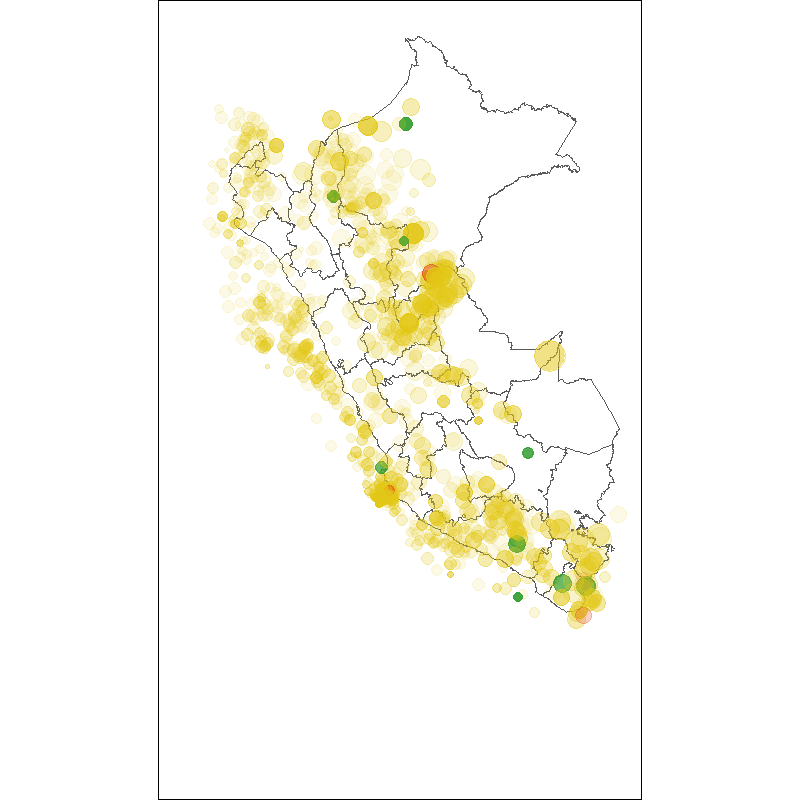

---
output: github_document
--- 


```{reval = F}
eq <- read_csv("output/igp.csv")
```

```{r eval = F}
library(ggplot2)
library(gifski)
library(gganimate)
library(sf)

peru <- PeruData::peru_dep

x <- c(111, 12, 100)

eq1 <- 
    eq |> 
    mutate(year = lubridate::year(date)) |> 
    filter(year > 2010) |> 
    arrange(year) |> 
    group_by(alert) |> 
    mutate(
        intensi_km = BBmisc::normalize(intensi_km, "range", range = c(0, 1)) + .11,
        magn = BBmisc::normalize(magn, "range", range = c(0, 1), + 0.1)
        ) |> 
    ungroup() 

alerts <- unique(eq$alert)

names(alerts) <- c("green", "yellow", "red")

p1 <- 
    ggplot(data = eq1) +
    geom_sf(data = peru, fill = "#FFFFFF") +
    geom_point(aes(lon, lat, size = intensi_km, alpha = magn, color = alert)) +
    scale_size(range = c(2, 16)) +
    theme_void() +
    scale_color_manual(values = c("#36a035", "#e23c16", "#e2c716")) +
    #labs(title = "Date = {frame_time}") +
    theme(
        legend.position = "none", 
         panel.background = element_rect(fill='transparent'),
         plot.background = element_rect(fill='transparent', color=NA),
         panel.grid.major = element_blank(),
         panel.grid.minor = element_blank(),
         legend.background = element_rect(fill='transparent'),
         legend.box.background = element_rect(fill='transparent'
       )
        ) +
    #transition_time(year) +
    enter_fade() + 
    transition_states(year, transition_length = 12, state_length = 12) +
    #transition_states(layer_length = 3, transition_length = 3) +
    #transition_manual(time, cumulative = F) +
    enter_grow() +
    exit_shrink() +
    exit_fade()
#anim_save()    

animate(p1, duration = 20, height = 800, width =800, renderer = gifski_renderer("peru_earthquake.gif")) 
```


